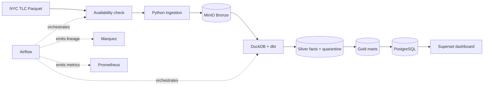

# Architecture

## Data flow

## Medallion contracts

- **Bronze:** immutable source objects, deterministic paths, SHA-256 and ingestion manifest.
- **Silver:** typed fields, timestamps normalized from America/New_York to UTC, deterministic
  `trip_id`, quality reason, deduplication, incremental `fact_trips`, and quarantine.
- **Gold:** business-grain marts rebuilt from facts and published transactionally by affected month.

## Runtime profiles

- Core: PostgreSQL, MinIO, Airflow, DuckDB/dbt and Superset.
- `observability`: StatsD exporter, PostgreSQL exporter, Prometheus and Grafana.
- `lineage`: Marquez API/UI and OpenLineage emission from Airflow.
- `streaming`: Redpanda, event replay and minute/zone consumer.
- `spark`: one master, one worker and a distributed summary job.

The optional profiles keep the default footprint suitable for a 16 GB development machine.
